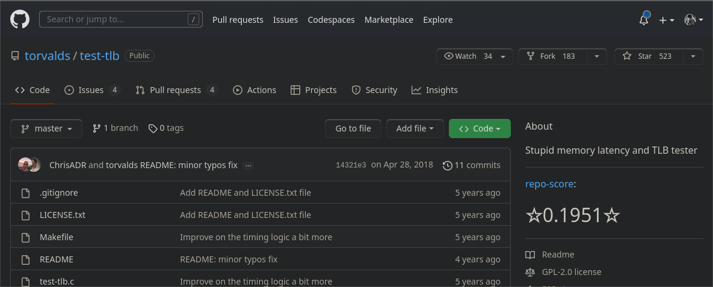

# RateRepo

A simple web extension that rate from you a github repository based on some elements and a small formula !

The rating for a GitHub repository is calculated using a weighted average of several factors. These factors are:

- `stars`: the number of stars the repository has received
- `commits`: the number of commits in the repository
- `commitFrequency`: the frequency of commits in the repository
- `contributors`: the number of contributors to the repository
- `forks`: the number of forks of the repository
- `releases`: the number of releases of the repository
- `issueFrequency`: the frequency of issues being opened and closed in the repository
- `watchers`: the number of users watching the repository
- `isArchived`: a binary value indicating whether the repository is archived (1) or not (0)
- `branches`: the number of branches in the repository

Each of these factors is given a weight in the formula, and the resulting value is divided by the sum of all the weights to get the final rating. The weights are:

- stars: 5
- commits: 7
- commitFrequency: 5
- contributors: 4
- forks: 5
- releases: 3
- issueFrequency: 7
- watchers: 10
- isArchived: 1
- branches: 3

So the formula for the rating is:

```javascript
const rating = (
    (stars / 5) + (commits / 7) + (commitFrequency / 5) +
    (contributors / 4) + (forks / 5) + (releases / 3) +
    (issueFrequency / 7) + (watchers / 10) + isArchived + (branches / 3)
) / (stars + commits + commitFrequency + contributors + forks + releases +
    issueFrequency + watchers + isArchived + branches)
```


